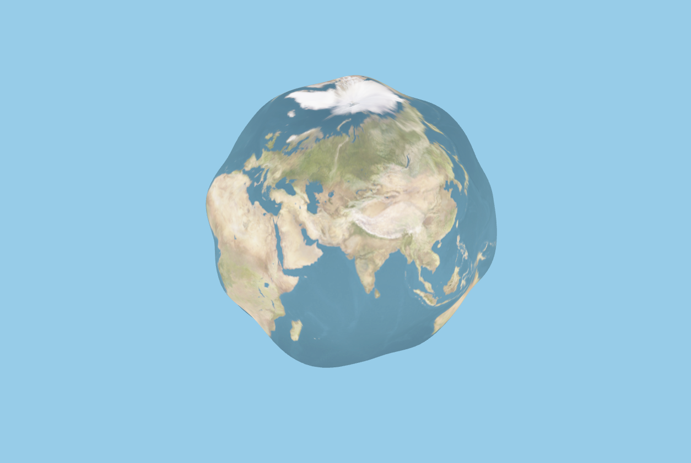
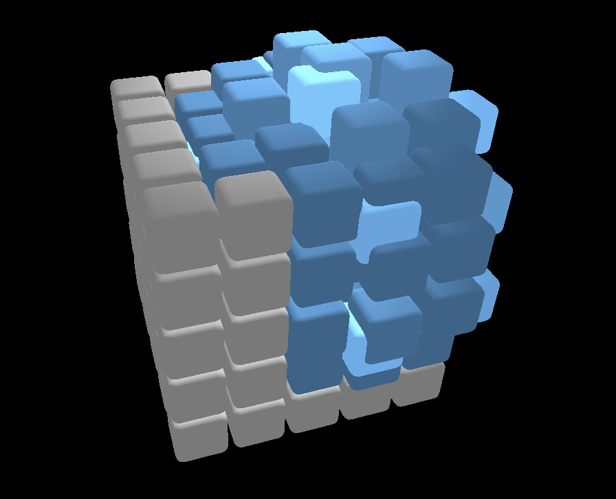
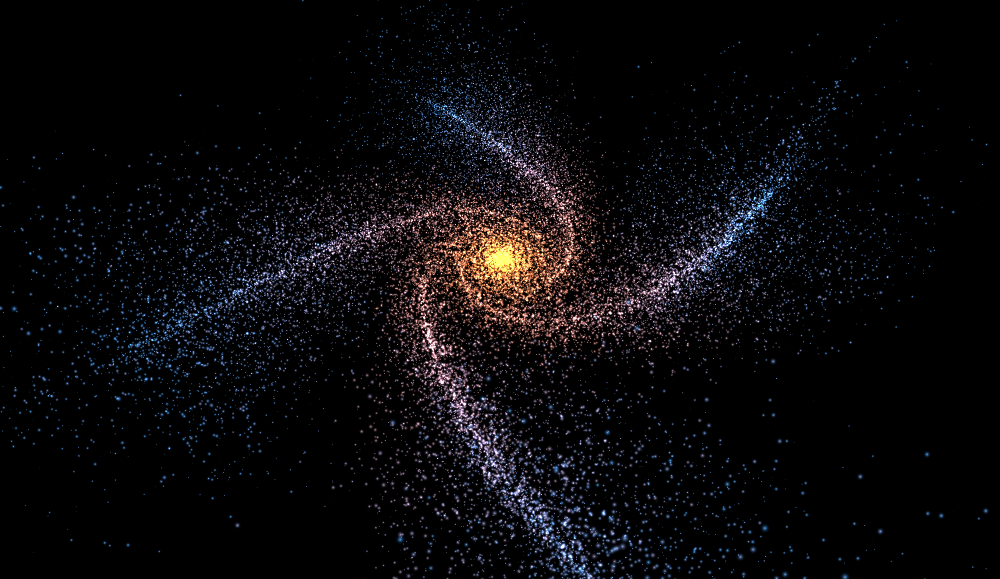

# Threejs Sketches

I like making threejs sketches and showing them to people on the internet, but there was no one place where I can collect them all.

So, here I present to you all my dumping ground for threejs sketches.

Visit the site [here](https://sketches-sarlloc.vercel.app).

This project is made using typescript. But the sketches use a lot of glsl as well. 

### The current few sketches are:

> Will keep adding more and more with time.

1. [Blobby Earth](https://sketches-sarlloc.vercel.app/sketch/blobby-earth)

___

2. [Interactive Cubes](https://sketches-sarlloc.vercel.app/sketch/cubes)

___

3. [Galaxy](https://sketches-sarlloc.vercel.app/sketch/galaxy)

